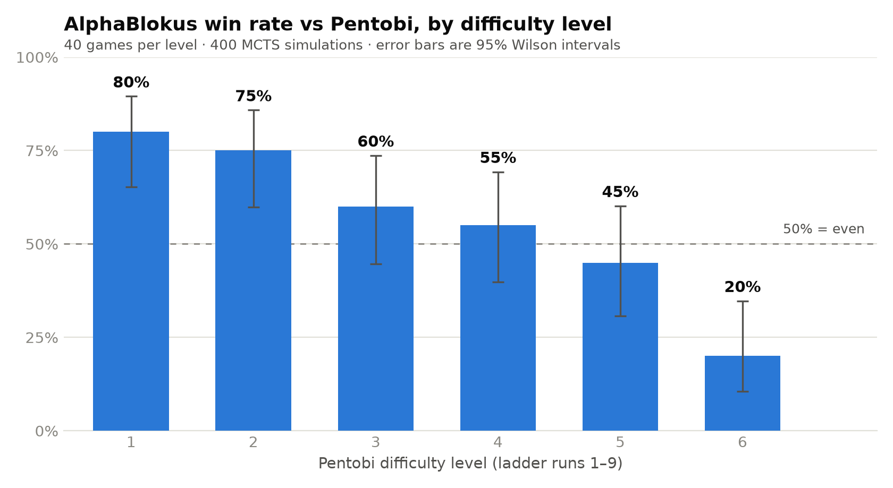

# AlphaBlokus

[](https://github.com/HenryTBCassidy/AlphaBlokus/actions/workflows/ci.yml)

**A from-scratch AlphaZero implementation for Blokus Duo — Monte Carlo Tree Search + self-play reinforcement learning with deep ResNet policy/value networks (PyTorch), on a game-agnostic engine with a GPU-native JAX self-play backend.**

No human games, no handcrafted heuristics. The system learns Blokus Duo — a two-player territorial game on a 14×14 board with 21 polyomino pieces per player and a 17,837-action space — entirely through self-play, following [AlphaZero](https://www.science.org/doi/10.1126/science.aar6404). The benchmark opponent is [Pentobi](https://pentobi.sourceforge.io/) (MCTS + RAVE, the strongest open-source Blokus engine); the goal is to beat it at its maximum difficulty, level 9.

**Status (July 2026) — work in progress.** The current best network beats Pentobi convincingly at levels 1–2, holds a winning record through level 4, is statistically even at level 5, and clearly loses at level 6. Pure self-play has scaled on cloud GPUs (RTX 5090 via RunPod) with a larger network and ~10,000 self-play games per generation, but plateaued at level 4. The current direction is to break that plateau by distilling from Pentobi — supervised imitation of expert-level games, then continued self-play beyond the teacher, following the [AlphaGo](https://www.nature.com/articles/nature16961) bootstrap.

## Results vs Pentobi

<picture>
  <source media="(prefers-color-scheme: dark)" srcset="docs/assets/pentobi-ladder-dark.png">
  
</picture>

| Pentobi level | W–L–D | Win rate | 95% CI |
|---|---|---|---|
| 1 | 32–8–0 | 80% | [65, 90] |
| 2 | 30–9–1 | 75% | [60, 86] |
| 3 | 24–14–2 | 60% | [45, 74] |
| 4 | 22–17–1 | 55% | [40, 69] |
| 5 | 18–22–0 | 45% | [31, 60] |
| 6 | 8–30–2 | 20% | [10, 35] |

Current best checkpoint — a 192-filter × 12-block ResNet (~ 8M parameters) after ~ 70 generations (~ 700k self-play games) — playing 40 games per level at 400 MCTS simulations per move, via the project's [Pentobi GTP harness](docs/05-EVALUATION.md). Levels 7–9 remain untested; level 6 is the current frontier.

## How it works

Each *generation* of the training loop:

1. **Self-play** — the current network plays thousands of games against itself, guided by MCTS; visit distributions and outcomes become training targets.
2. **Train** — the ResNet learns to predict MCTS move probabilities (policy head, KL loss) and game outcomes (value head, MSE loss).
3. **Gate** — the candidate plays the incumbent in an arena; it is promoted only if it scores above a threshold (chess-style `wins + ½·draws`).
4. **Evaluate** — relative Elo is tracked per generation, an end-of-run pooled [BayesElo tournament](docs/research/pool-elo-methodology.md) rates all checkpoints against each other (DeepMind's methodology), and checkpoints are benchmarked externally against Pentobi.

The framework is game-agnostic (protocol interfaces for game rules, boards, and networks, with a single composition root) and was validated end-to-end on Tic-Tac-Toe — where it reaches near-perfect play against a minimax oracle within a couple of generations — before Blokus was plugged in. Algorithms are documented in [`docs/02-ALGORITHMS.md`](docs/02-ALGORITHMS.md), network architecture in [`docs/03-NEURAL-NETWORKS.md`](docs/03-NEURAL-NETWORKS.md).

## Engineering highlights

Most of the work in an AlphaZero project is systems engineering — making self-play cheap enough, and evaluation trustworthy enough, to iterate at scale.

- **GPU-native self-play in JAX** ([`games/blokusduo/jax/`](src/alphablokus/games/blokusduo/jax/)) — game rules reimplemented as batched int8 matmuls (placement legality, game end, legal-move masks), searched with [mctx](https://github.com/google-deepmind/mctx) [Gumbel AlphaZero](https://openreview.net/forum?id=bERaNdoegnO) over a top-K compacted action space, with an inference-only JAX net bridged from the torch checkpoint each generation. **~12× self-play throughput** at production net size, A/B-validated at strength parity with the python engine and parity-gated in CI ([study](docs/research/jax-pipeline-ab.md)).
- **A ~14× optimisation stack on the python engine** — multiprocess self-play/arena workers (5.7× at 8 workers), Pentobi-style precomputed move-generation tables (9× per call), batched MCTS leaf evaluation with virtual loss, and a fully-convolutional policy head (21.6× fewer parameters). Each step was profiled, measured, and recorded ([tracker](docs/plans/archive/full-cycle-optimisation.md)); a cross-worker inference server was built, benchmarked, and deliberately **not** adopted when it showed no win.
- **Memory engineering for long runs** — boards stored as 196-byte compact states in a rolling game-level replay buffer and lazily re-encoded to 44×14×14 tensors at batch time (~175× less buffer RAM); sparse on-disk policy storage with streamed parquet I/O (the dense format was ~71 KB/position); startup RAM-budget checks and peak-RSS logging.
- **Cloud training** — Dockerised uv environment, S3-compatible checkpoint sync, and `--resume` from the last completed generation, so a spot GPU dying mid-run costs one generation, not the run.
- **Evaluation you can trust** — gated arena promotion, pooled BayesElo tournaments across checkpoints (relative Elo curves don't saturate the way a fixed-baseline metric does), and an external anchor: a GTP client + move-translation layer driving real Pentobi binaries across its nine difficulty levels.
- **Engineering discipline throughout** — installable `src/` package, strict mypy (`disallow_untyped_defs`), ruff lint + format in CI, tests mirroring the source tree, and bit-identical parity gates wherever two implementations of the same rules coexist (python vs JAX, python vs the TypeScript web port).

## Architecture

```
src/alphablokus/
├── interfaces.py       # IBoard / IGame / IPolicyValuePredictor / INeuralNetWrapper protocols
├── registry.py         # Composition root — the only module naming concrete games/backends
├── search/             # MCTS: PUCT, Dirichlet root noise, batched inference + virtual loss
├── selfplay/           # Episode loop + backend dispatch (serial / parallel / JAX)
├── parallel/           # Worker pool for self-play, arena, and Elo games
├── training/           # Coach generation loop, replay buffer, eval set, memory diagnostics
├── evaluation/         # Arena, acceptance gate, Elo, pooled BayesElo tournament
├── storage/            # Parquet metrics + self-play stores, sparse policy codec, W&B mirror
├── reporting/          # Self-contained interactive HTML report (offline SVG charts + arena replay browser)
└── games/
    ├── tictactoe/      # Reference implementation + minimax oracle
    └── blokusduo/      # Board/rules/codecs, move-gen tables, Pentobi GTP, JAX backend, ResNet
```

Framework code depends only on the protocol interfaces; adding a game means implementing them under `games/<name>/` and registering it in `registry.py`. Blokus specifics: a 44-channel board encoding (21 per-piece planes per player + 2 aggregate), immutable board states keyed by a 196-byte placement grid (so MCTS gets transposition handling for free), and codecs mapping the 17,837-action space. Tests live in `tests/`, mirroring the source tree one-to-one.

## Quickstart

Requires Python 3.11+ and [`uv`](https://docs.astral.sh/uv/).

```bash
git clone https://github.com/HenryTBCassidy/AlphaBlokus.git
cd AlphaBlokus
uv sync --extra dev             # + --extra jax (CPU) or --extra jax-cuda (NVIDIA) for the JAX backend
uv run pytest -m "not slow"     # test suite (drop the marker for integration tests)

# Quick end-to-end pipeline check (CPU, seconds)
uv run alphablokus --config run_configurations/test_run.json

# Tic-Tac-Toe demo (CPU, ~10 min)
uv run alphablokus --config run_configurations/ttt_mac_demo.json

# Small Blokus run (python backend) / production-style run (JAX Gumbel backend, GPU)
uv run alphablokus --config run_configurations/blokus_3gen.json
uv run alphablokus --config run_configurations/blokus_jax_gumbel_30.json
```

Set `"cuda": true/false` in the config's `net_config` to match your machine. Every run writes a self-contained interactive HTML report to `temp/<run_name>/Reporting/report.html`; `--report-only` re-renders it without retraining, `--resume` continues a stopped run. Pentobi benchmarking: `uv run python scripts/pentobi_benchmark.py --sweep` (needs a `pentobi-gtp` binary).

## Play against it

A browser build runs the full engine client-side — TypeScript rules port, MCTS, and the network via ONNX Runtime Web (WebGPU with WASM fallback) — plus a full-strength local tier serving the real torch + MCTS stack behind the same frontend. Fidelity is enforced, not assumed: the TS port replays fixture games byte-identically against the python engine, and full games are verified ply-by-ply across the two stacks. Setup in [`docs/plans/archive/web-play.md`](docs/plans/archive/web-play.md); calibration study in [`docs/research/web-play-calibration.md`](docs/research/web-play-calibration.md).

## Documentation

Design docs: [background & why Blokus](docs/01-BACKGROUND.md) · [algorithms](docs/02-ALGORITHMS.md) · [neural networks](docs/03-NEURAL-NETWORKS.md) · [Blokus Duo rules & pieces](docs/04-BLOKUS-DUO.md) · [evaluation & Elo](docs/05-EVALUATION.md) · [Pentobi interface](docs/06-INTERFACES.md) · [data storage](docs/07-DATA-STORAGE.md) · [compute options](docs/09-COMPUTE-OPTIONS.md).

The project is developed against written implementation plans: [`docs/plans/archive/`](docs/plans/archive/) holds ~40 completed plans (the full engineering history — move generation, batched inference, the JAX pipeline, the replay-buffer refactor, OOM hardening, cloud scaling, …), and [`docs/research/`](docs/research/) holds the deeper investigations (profiling reports, A/B studies, the pool-Elo methodology).

## References

- Silver et al., [Mastering the game of Go without human knowledge](https://www.nature.com/articles/nature24270) (AlphaGo Zero, 2017)
- Silver et al., [A general reinforcement learning algorithm that masters chess, shogi, and Go through self-play](https://www.science.org/doi/10.1126/science.aar6404) (AlphaZero, 2018)
- Danihelka et al., [Policy improvement by planning with Gumbel](https://openreview.net/forum?id=bERaNdoegnO) (2022) — the low-simulation search the JAX backend uses
- [mctx](https://github.com/google-deepmind/mctx) (DeepMind) — JAX-native MCTS
- [Pentobi](https://pentobi.sourceforge.io/) (Markus Enzenberger) — the benchmark opponent, and the source of the precomputed move-generation design
- [alpha-zero-general](https://github.com/suragnair/alpha-zero-general) (Surag Nair) — the game-agnostic framework pattern this started from

## License

[MIT](LICENSE).
