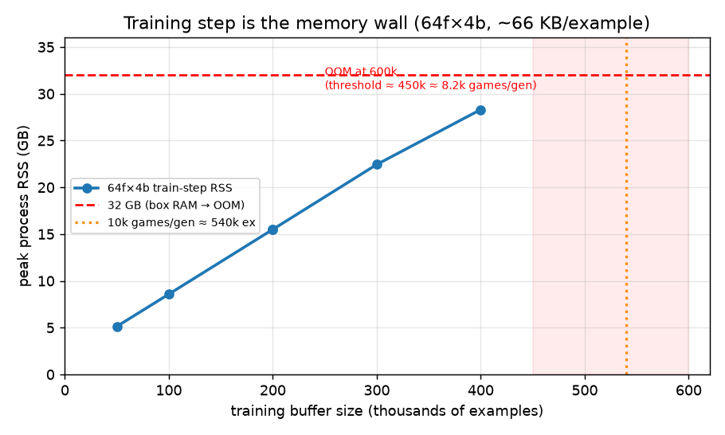

# Linux Memory Profile — Self-Play & Training (2026-06-18)

Where memory goes, and **whether 10,000 games/generation fits in 32 GB**. Part of
[linux-performance-profiling.md](../plans/linux-performance-profiling.md) (Step 3).
Companion: [linux-time-profile.md](linux-time-profile.md). Headline + recommendations:
[linux-performance-findings.md](linux-performance-findings.md).

**Method.** Same box/commit as the time profile. Three targets: the in-episode MCTS
tree (tracemalloc), the self-play process footprint, and the **training step** on a
synthetic buffer sized to games/gen (`profile_self_play.py memory` / `train`).

**Conversion:** measured **~51–57 examples/game** (≈ 2× moves/game, the order-2 symmetry
augmentation). So **1k games ≈ 53k examples**, **10k games ≈ 530k examples** (at
`max_generations_lookback = 1`; more lookback scales the buffer up further).

---

## 1. In-episode MCTS tree — a non-issue

| net | tree states / game | peak Python heap | process RSS |
|-----|--------------------|------------------|-------------|
| 64f×4b | 6,769 | 31.2 MB | 1,451 MB |
| 128f×8b | 6,398 | 26.5 MB | 1,454 MB |
| 256f×10b | 6,387 | 28.8 MB | 1,457 MB |

The sparse MCTS tree is **~30 MB/game** — the sparsification work holds. Per-process RSS
is ~1.45 GB, **dominated by the torch+CUDA stack**, and ~net-size-independent at these
sizes. So **self-play memory at 16 workers ≈ 16 × 1.45 ≈ 23 GB** — fits 32 GB with room.
Self-play is *not* the memory risk.

## 2. Training step — the memory wall

`train()` on a synthetic buffer, 64f×4b:

| buffer (examples) | ≈ games/gen | peak RSS | train wall |
|-------------------|-------------|----------|------------|
| 50k | ~0.9k | 5.1 GB | 9.9 s |
| 100k | ~1.9k | 8.6 GB | 19.1 s |
| 200k | ~3.8k | 15.5 GB | 38.1 s |
| 300k | ~5.7k | 22.4 GB | 57.5 s |
| 400k | ~7.5k | 28.3 GB | 81.4 s |
| **600k** | **~11.3k** | **OOM (killed)** | — |

RSS scales **~66 KB/example** (linear), base ~1.8 GB. The OOM threshold is
**≈ 450–460k examples ≈ ~8,500 games/gen**.

**→ 10k games/gen (~530k examples) needs ~37 GB → OOMs on the 32 GB box by ~5 GB.**
This is the hard blocker for the scale-up.

**Root cause (verified in code, not the policy):** the policy is *already* stored sparse
(`sparsify`, `self_play.py:104`). The driver is the **board, stored as dense 44×14×14
encoded planes** (`x[0].as_multi_channel(1)` — float32, ~34.5 KB each). The training
`Dataset` then copies all of them into one big float32 tensor
(`np.asarray(boards, dtype=np.float32)`, `base_wrapper.py:72`) *while the source list is
still alive* → ~2× → the measured ~66 KB/example. **Lever:** store boards compactly in the
buffer (the 196-byte int8 piece-placement board) and **encode to planes lazily per
mini-batch** in `Dataset.__getitem__` — exactly the pattern already used for sparse
policies. That cuts buffer board RAM ~175× and removes the up-front tensor (see findings).

## 3. Bigger net — buffer-dominated memory, but training time explodes

256f×10b `train()` @ 200k examples: **RSS 15.5 GB** (≈ identical to 64f×4b's 15.5 GB —
the buffer dominates, model/activations are minor at this batch size) but **wall 443 s vs
38 s — 11.6× slower**. So a bigger net barely changes the *memory* ceiling, but makes the
training step a serious *time* cost (and self-play ~1.55× slower — see time report).

## 4. Verdict

| Scenario | games/gen | training-step RAM | fits 32 GB? |
|----------|-----------|-------------------|-------------|
| current prod | 1,000 | ~5 GB | ✅ comfortably |
| safe ceiling | ~8,000 | ~30 GB | ✅ (tight) |
| **target** | **10,000** | **~37 GB** | ❌ **OOM** |
| target + lookback>1 | 10,000+ | ≫37 GB | ❌ worse |

Self-play is memory-safe at any of these (≈23 GB at 16 workers). **The training step is
the sole blocker**, and it blocks exactly the 10k-games/gen target. The fix is sparse
policy storage in the buffer — concretely tractable (mirrors the MCTS sparsification).
