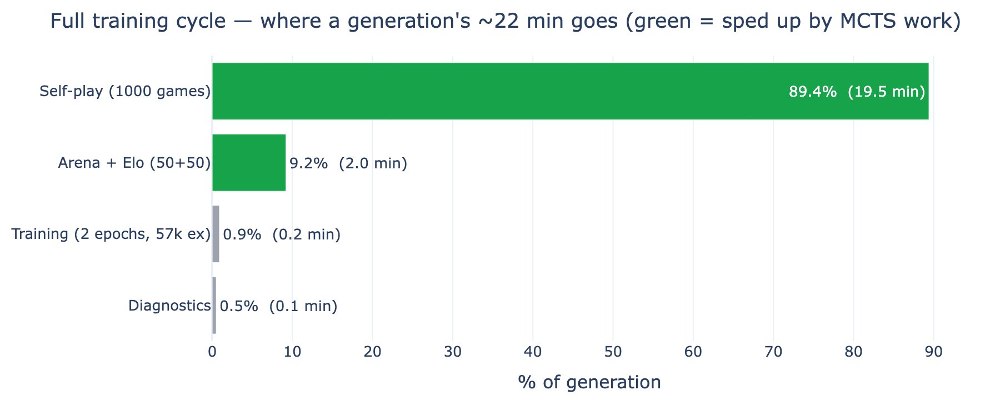
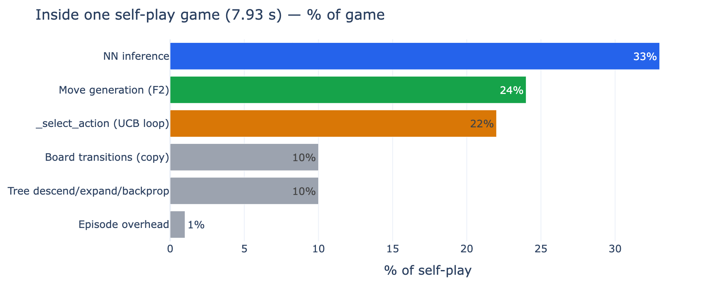
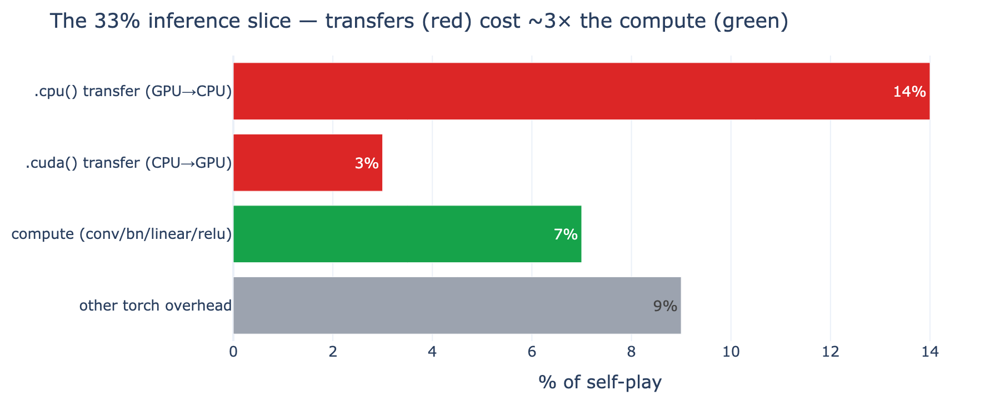
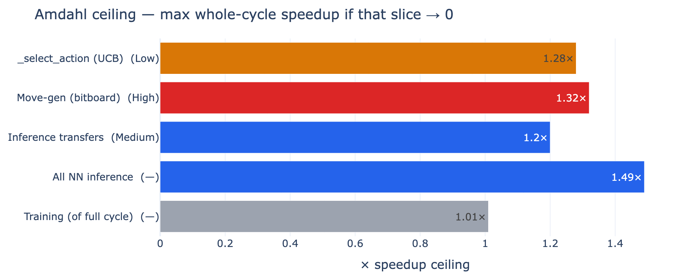

# AlphaBlokus — Training-Cycle Profiling Report

**Measured 2026-06-05** on the RTX 3060 Ti at the production config (`blokus_scaled_15.json`: 300 sims, K=16, conv 64f×4b, CUDA, **F2 move-gen on**), via [`scripts/profile_self_play.py`](../../scripts/profile_self_play.py) — cProfile for function times, the built-in MCTS phase timers for inference-vs-rest, and a synthetic-buffer run for training cost. Charts regenerate with [`scripts/profile_report.py`](../../scripts/profile_report.py). Interactive version: `profiling-report.html` (open locally — GitHub won't render raw HTML).

> **Headline.** Self-play is **CPU-bound** (GPU idles ~0–30%). No single bottleneck — inference, move-gen, and the UCB loop are three roughly **co-equal thirds**. **Training is ~1% of the cycle.** Surprise: inference's cost is dominated by GPU↔CPU **transfers**, not compute.

---

## 1. Where a generation's time goes (~21 min/gen → ~5.3 h for 15 gens)



| Phase | Wall / gen | % of cycle | Sped up by MCTS work? |
|-------|-----------|------------|------------------------|
| **Self-play** (1000 games) | ~19.5 min | **~90%** | ✅ |
| Arena + Elo (50 + 50) | ~2 min | ~7% | ✅ (same MCTS loop) |
| **Training** (2 epochs, 57k ex) | **12.3 s** | **~1%** | ❌ separate phase |
| Diagnostics | <0.1 min | ~0% | ❌ |

Self-play + arena + elo all run the **same MCTS play-loop**, so MCTS work speeds up *three of the four* phases. Training is the only phase it doesn't touch — and it's a rounding error.

## 2. Inside one self-play game (7.93 s)



| Slice | % of self-play | Nature |
|-------|----------------|--------|
| **NN inference** | ~33% | mostly GPU↔CPU **transfers** > compute (see §3) |
| **Move generation** (F2) | ~24% | native-ish; `_fill_legal_actions_for_anchor` core |
| **`_select_action`** (UCB loop) | ~22% | **pure Python** loop, `math.sqrt` ×2.5M/game — vectorisable |
| Board transitions (copy) | ~10% | numpy board copies |
| Tree descend / expand / backprop | ~10% | Python |
| Episode overhead | ~1% | |

## 3. The inference slice — transfers, not compute



The kicker: moving the K=16 result tensors GPU↔CPU (`.cpu()` ~14% + `.cuda()` ~3%) costs **~3× the actual conv math** (~7%). So the inference lever is about *transfer overhead*, not a faster net.

## 4. Amdahl ceilings — how much each lever could ever buy



Even driven to *zero*, each slice's whole-cycle ceiling is `1/(1-p)`. Training's ceiling is **1.01×** — which is why it's not worth touching.

---

## Verdict — RUN NOW; optimisation optional

The 15-gen run projects to **~5.3 h** — comfortably overnight (target ≤12 h) and inside tight-iteration (≤6 h), RAM flat (OOM fix verified). The end goal is a strong net, bought with **generations trained**, not seconds shaved. So: **train.**

**Don't optimise training** — ~1% of the cycle, ceiling 1.01×. The conv net + 2 epochs are already efficient; the memory fix solved its only real problem.

**When tighter iteration is wanted, the ranked levers:**

| Rank | Lever | Win | Effort | Why |
|------|-------|-----|--------|-----|
| 1 | **Vectorise `_select_action`** | ~1.25× | **Low** | pure-Python UCB loop, 22% of self-play, numpy-vectorisable, bit-identical-testable — best ROI |
| 2 | **Cut inference transfer overhead** | ~1.15–1.2× | Medium | `.cpu()`/`.cuda()` dominate inference; fewer/larger transfers, pinned memory |
| 3 | **Bitboard move-gen** | ~1.3× | **High** | move-gen still 24% post-F2; structural rewrite — only path to ≤3 h, multi-week |

#1 + #2 plausibly take ~5.3 h → ~3.5–4 h. None of it is needed for the run.

---

## Raw evidence — cProfile top functions (1 game, 300 sims, F2 on; total 8.941 s)

```
   ncalls  tottime  cumtime  function
    57224    1.788    1.842  movegen_runtime.py:201(_fill_legal_actions_for_anchor)   <- move-gen core
    14444    1.695    1.938  mcts.py:346(_select_action)                              <- UCB loop (pure Python)
      888    1.242    1.242  {method 'cpu' of torch.TensorBase}                       <- GPU->CPU transfer
     4884    0.369    0.369  {built-in method torch.conv2d}                           <- actual NN compute
      444    0.292    0.292  {method 'cuda' of torch.TensorBase}                      <- CPU->GPU transfer
     6746    0.247    2.531  mcts.py:388(_expand_leaf)
    14162    0.127    0.823  board.py:228(with_piece)                                 <- board copy
  2518748    0.100    0.100  {built-in method math.sqrt}                              <- UCB, 2.5M calls/game
cumulative: predict_batch 2.927 (33%) | valid_move_mask 2.188 (24%) | _select_action 1.938 (22%)
```

Self-play: **7.93 s/game** (28 moves, 55 examples, 6,845 tree states). Training: **12.3 s** for 57k examples × 2 epochs, **RSS 5.6 GB** (the OOM fix — not 27 GB).

*Process record: [`../plans/archive/profiling-investigation.md`](../plans/archive/profiling-investigation.md). Technique menu + Amdahl detail: [`self-play-speed-investigation.md`](self-play-speed-investigation.md).*
